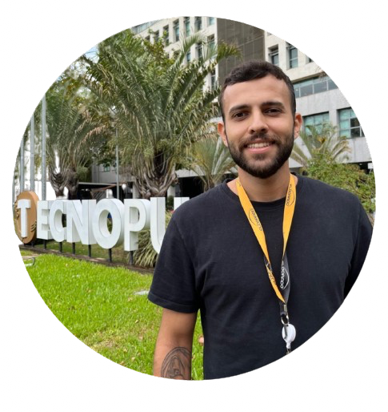
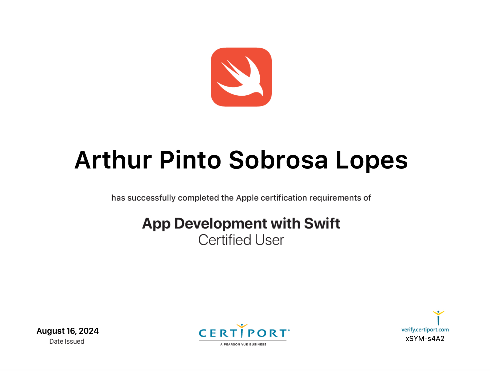
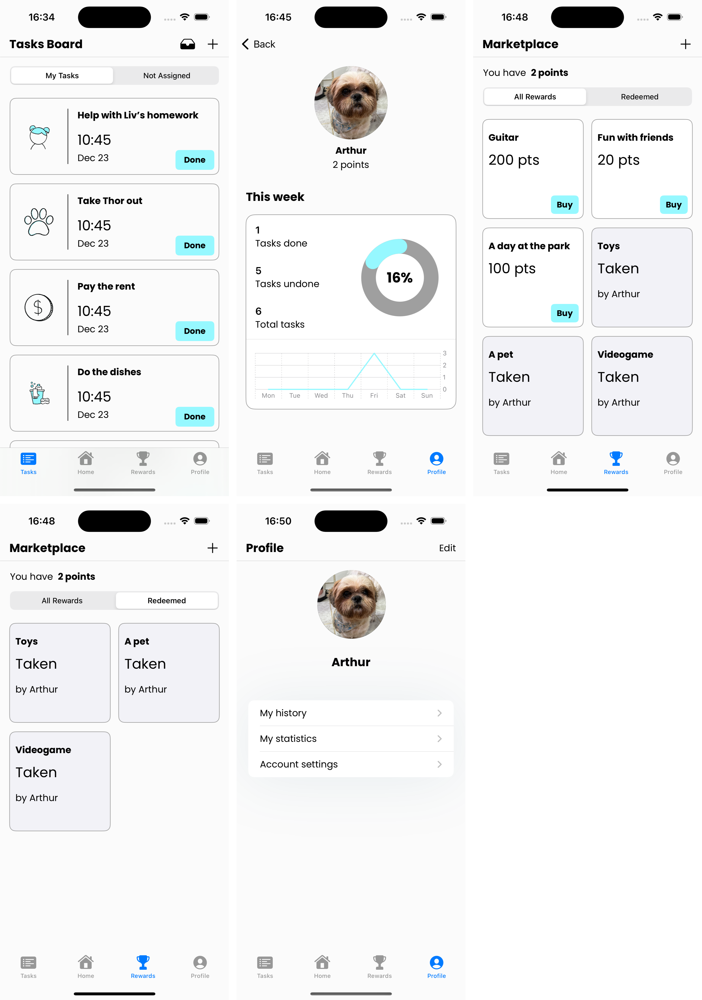
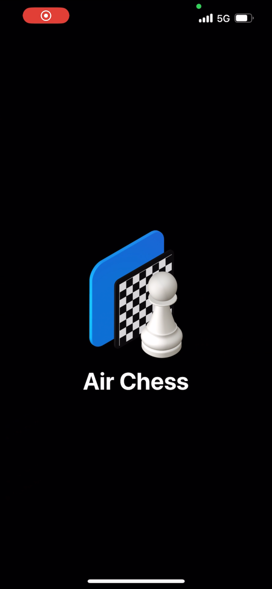
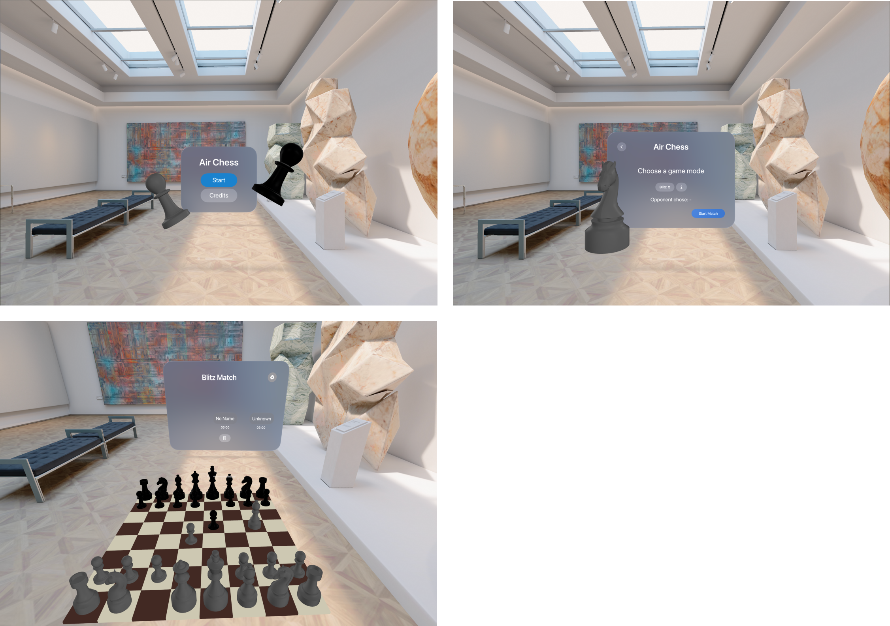

# Arthur Sobrosa's Portfolio

## About me

  

Hello! My name is <b>Arthur Sobrosa</b> and I'm an <b>iOS developer</b>. I also study computer science at UFRGS - Brazil. I am participating in the 
<b>Apple Developer Academy</b> program in Porto Alegre for a year and have been building up knowledge in this area since then.

In 2024, I was one of the winners of the <a href="https://developer.apple.com/swift-student-challenge/">Swift Student Challenge</a>, which awards 350 students
of Swift around the world and this have pushed me to continue learning and improving my skills in this language.

I am familiar with <b>SwiftUI</b>, <b>UIKit</b> and some other native frameworks, such as <b>SpriteKit</b>, <b>GameKit</b>, <b>ARKit</b>, <b>RealityKit</b>,
<b>CoreData</b>, <b>CloudKit</b> and <b>Combine</b>.

I am also a App Development with Swift Certified User:

  

And those are my contacts:

  <a href="https://www.linkedin.com/in/arthur-sobrosa-557013207/">LinkedIn</a>

  <a href="https://github.com/arthursobrosa">GitHub</a>

  <a href="https://www.wwdcscholars.com/s/804C110F-384C-4679-A1A8-34E42B641DA4/2024">Swift Student Challenge Project</a>

Below I will list some of the projects I've participated in. I hope you enjoy!

---

## Tasky

Tasky is a task organization and management app to be used within a familiar environment. Users can create and assign tasks,
accumulate points and use them to redeem rewards. It is also possible to create profiles and join a family, so that all members
can monitor the completion of their household tasks.

### Technologies: SwiftUI and CloudKit (to store tasks and rewards in the cloud)

---

# AirChess

  

AirChess is an augmented reality chess app available for iPhone and VisionPro. Users can play multiplayer matches
and challenge themselves in the game without the need of a real board.

AppStore Link: <a href="https://apps.apple.com/app/airchess/id6498967964">AirChess</a>

## Check out the iPhone version:

## And the VisionPro version:

### Technologies: SwiftUI, UIKit, ARKit e RealityKit (for iPhone's AR), RealityKitContent (for VisionPro immersive spaces) e GameKit (for multiplayer)

---

# Bisca 

Bisca is a fun card game where players can challenge each other and play multiplayer games through Game Center. It is also possible to play the singleplayer mode and to share the app experience using FaceTime and Messages via the SharePlay support.

AppStore Link: <a href="https://apps.apple.com/app/bisca/id6502881813">Bisca</a>

### Tecnologias utlizadas: UIKit, GameKit, SpriteKit, View Code

---

# Tuco-Tuco

Tuco-Tuco is an interactive app for iPhone that raises awareness for a brazilian endangered species. 
This game was responsible for making me one of the winners of the Swift Student Challenge 2024, and therefore
I will always cherish it!

AppStore link: <a href="https://apps.apple.com/br/app/the-tuco-tuco/id6481862059?l=en-GB">Tuco-Tuco</a>

<a href="https://www.youtube.com/watch?v=9J21e1M8Oc0">YouTube video</a>

### Technologies: SwiftUI e Combine (to manage the animations)

---
